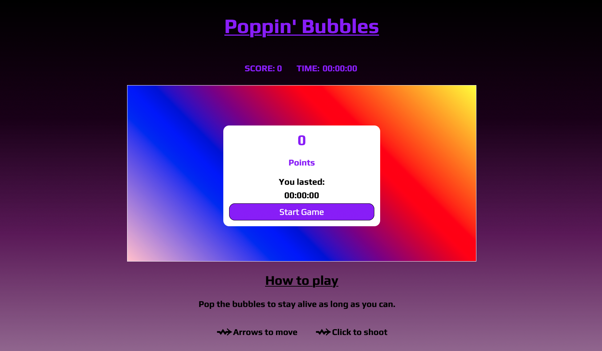

# Canvas-Game

## Live site:

https://clemsk.github.io/Canvas-Game/

## Brief

- Build a game using Vanilla Javascript
- Render a game in the browser
- Design logic for winning & visually display which player won
- Include separate HTML / CSS / JavaScript files
- Use Javascript for DOM manipulation
- Deploy the game online
- Use semantic markup for HTML and CSS

## Initial intent

To create a game in canvas with point-and-click shooting game with arrow key movement for character.

## Technologies used:

JavaScript, HTML and CSS

## Plan / Workflow:

I had the option of choosing to either make grid or canvas based game, and selected canvas as it presented more of a challenge and gave me the opportunity to explore how animations work in this format.

Before landing on my idea, I brainstormed different types of games that I wanted to make and settled on a point and click shooting game with arrow-key movement.

Once decided I drew wireframes on a whiteboard and then in Evernote (I had not yet discovered Figma) and formed the basis of my design.

## Mvp

Having the character and enemies being drawn, and the ability to shoot them.

## Bonus

Having a timer that resets each turn
In-game music

## Running the app

On downloading the game there are no dependencies, the project only includes JavaScript, HTML and CSS.
To run locally you will just need a working version of Node.js and Live Server (localhost:3000 or other port) in your code editor to play the game.
I used Live Server in VS Code before deploying.

## Where I ended up

I'm pleased with where I ended up as my first project using JavaScript, HTML and CSS and version control.
I made mistakes, got in the weeds, better understood how to scope a project but mostly understood the fundamentals of
the interactions between JavaScript, HTML and CSS. This project laid the foundations for moving on to more complex projects later on in the course and layer in frameworks like React.

## Highlights

I really enjoyed working with animations, understanding the process of drawing frames and creating something I loved.
A discovery was also learning about the interaction between hardware and software such as how a mouse functions with x and y axes and being able to trigger events based on the location of a click or button press with arrow keys.

## Struggles

There was a steep learning curve before being able to code movement in the canvas. Once over that hurdle I moved much more swiftly.
Collision detection: defining what are the edges of the game, character, enemies and projectiles was an interesting problem.
I also had to scale back the original vision of the game as the intended feature set would have taken more time than I had to implement.
Ultimately, this was a critical lesson to learn and helped me with project management for future projects: setting an MVP, 'nice-to-haves' and working on additional features as time allowed.

## What I would like to add to the project

- In game walls
- More points for larger enemies
- Recording 'Health' and having 'lives'
- Function for regenerating and 'Power-Ups'
- Two player mode where 2 players face-off
- Shield for not getting hit

## Would I recommend trying this?

Yes, working with canvas is great! As I mentioned above it was a lot of fun to learn about animations and the spectrum of applications available. I included a canvas element on my portfolio site https://clem-sk.com as a result of this project and also developed an interest in generative art. I'm currently experimenting with the p5.js library.
